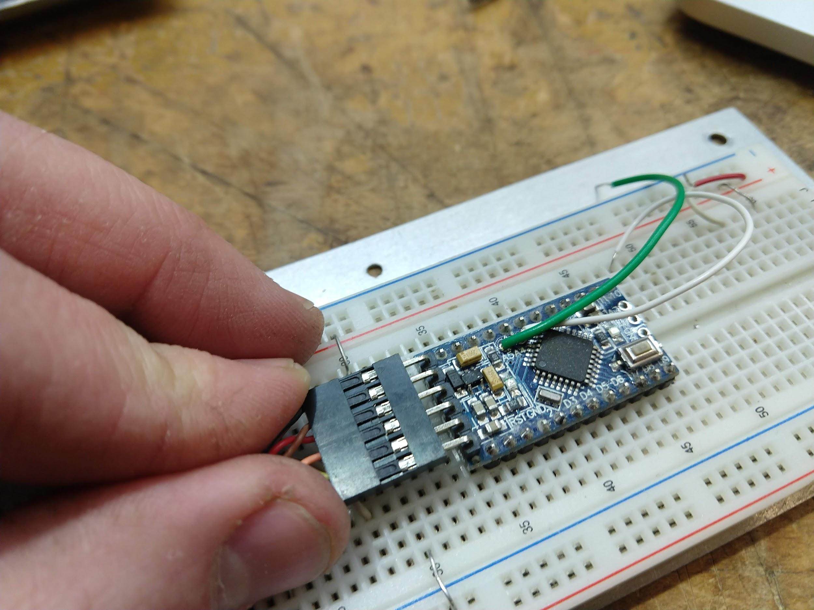

#Beambreak Reprogramming Instructions:

* Download and install the Arduino IDE.

* Plug in the FTDI USB-to-Serial adapter to the computer.

* Open the ‘BeamBreaks.ino’ file in the Arduino IDE.

* Install the "Adafruit_VL53L0X" Library using these instructions:

    * Open the "Sketch" menu

    * Navigate to "Include Library"

    * Select "Manage Libraries..."

    * In the "filter your search..." box, type “Adafruit_VL53L0X”

    * Click on the entry that appears, select "Version 1.0.4", and click install.

* Open the beam break box to expose the circuit board.

* Connect the 6 wire connector to the Pro Mini board, as shown below:

* Select the proper board using these instructions:

    * Open the "Tools" menu

    * Navigate to the "Board" submenu

    * Select "Arduino Duemilanove/Diecimila"

* Select the correct USB port:

    * Unplug the FTDI adapter

    * Open the "Tools" menu

    * Navigate to the Port Submenu

    * Make a note of what ports appear, if any

    * Close the menu.

    * Plug in the USB FTDI adapter.

    * Re-navigate to the port menu, and select the port which newly appears. On MacOS or linux, the port should be of the format "/dev/cu.usbserial-xxxxxxxx", while on Windows, it will appear as “COMXX” where the X’s are port numbers.

* After the board and port have been set, click the upload button in the sketch window or select "Upload" from the sketch menu.
