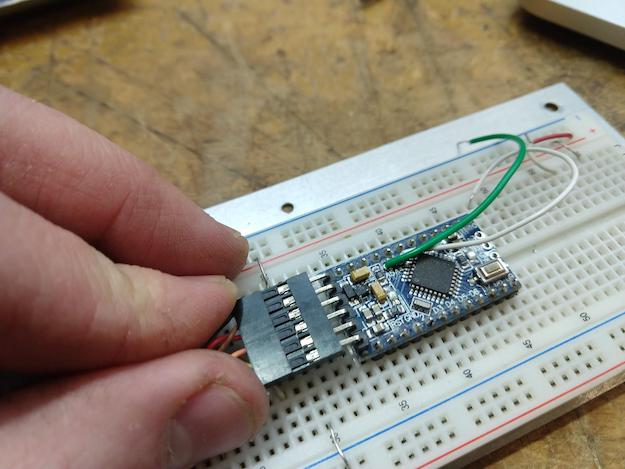

# Beambreak Reprogramming Instructions:

1. Download and install the [Arduino IDE](https://www.arduino.cc/en/Main/Software).

2. Plug in a FTDI USB-to-Serial adapter to the computer.

    * [Sparkfun's FTDI Cable 5V](https://www.sparkfun.com/products/9718) is a good option.

3. Open the [`BeamBreaks.ino`](../hardware/laneSensors/Arduino/BeamBreaks/BeamBreaks.ino) file in the Arduino IDE.

4. To change the sensitivity of the sensor, modify [line 13](https://github.com/cns-iu/xmacroscope/blob/35913851b549911571bc96524d1c69bc78ad804a/hardware/laneSensors/Arduino/BeamBreaks/BeamBreaks.ino#L13) of the `BeamBreaks.ino` file. If you are seeing false activations from the sensor, increment `countsToTrigger`; if you are missing activations, decrement `countsToTrigger`.

5. Install the `Adafruit_VL53L0X` Library using these instructions:

    * Open the `Sketch` menu

    * Navigate to `Include Library`

    * Select `Manage Libraries...`

    * In the `filter your search...` box, type `Adafruit_VL53L0X`

    * Click on the entry that appears, select `Version 1.0.4`, and click install.

6. Open the beam break box to expose the circuit board.

7. Connect the 6 wire connector to the Pro Mini board, as shown below:

8. Select the proper board using these instructions:

    * Open the `Tools` menu

    * Navigate to the `Board` submenu

    * Select `Arduino Duemilanove/Diecimila`

9. Select the correct USB port:

    * Unplug the FTDI adapter

    * Open the `Tools` menu

    * Navigate to the `Port` Submenu

    * Make a note of what ports appear, if any

    * Close the menu.

    * Plug in the USB FTDI adapter.

    * Re-navigate to the port menu, and select the port which newly appears. On MacOS, the port should be of the format `/dev/cu.usbserial-xxxxxxxx`, Linux should appear as `/dev/ttyACMX` while on Windows, it will appear as `COMXX` where the X’s are port numbers.

10. After the board and port have been set, click the upload button in the sketch window or select `Upload` from the sketch menu.
